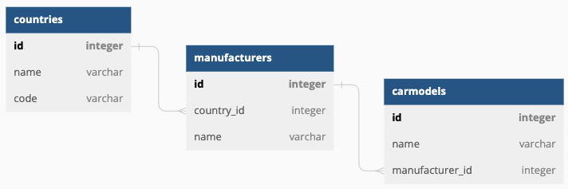

# Instruction for Lab 4

This is a lab assignment #4 in "Web Technologies II", year 2023.

Lab 4 extends the functionality developed in Lab 3 by improving the usability of code. To begin Lab 4, you need a working https://www.lab3.dev site:

- If you completed the [Lab 3 assignment](https://github.com/rauhvargers/TTII_2023_labs/blob/Lab3/README.md), continue with the code you already developed.
- If you did not do (or did not finish) the assignment, you can use [the sample code developed by the lecturer](https://github.com/rauhvargers/TTII_2023_labs/tree/Lab3_result).

## Task #1: Exdending the data model
The data structure defined in Lab 3 is Countries < Manufacturers < Carmodels  with only a few attributes.

Create a new migration:

  ``` 
  php artisan make:migration extend_manufacturers_carmodels
  ```

Edit the generated migration file to extend the models by adding the following attributes:

### manufacturers

- founded: integer - *stores the foundation year of the company*
- website: varchar (255) - *stores the website URL of the comany*

### carmodels

- production_started: integer - *stores the year, when model was first in production*
- min_price: decimal (8,2) - *minimal price in Euros*


## Task #2: handling the new attributes
 Update the app to wok with the new data:

 - Change the code of "new" and "edit" web forms for manufacturers & car models  to allow entering the new attributes: founded, website, production_started, min_price. Use simple `<input type="text" />` and don't worry about data validation at the client side – you will do it on the server.
- Change the `ManufacturerController`, `CarmodelController` controllers, as well as `Carmodel` and `Manufacturer` moddels to allow loading and saving the new attributes.

## Task #3: data validation
Add validation to `ManufacturerController` and `CarmodelController`. At minimum, set the following rules:
- Manufacturer name may not be empty
- Manufacturer name cannot exceed certain length
- Manufactuer name has to be unique in the database
- Website URL of the manufacturer has to be a valid URL
- Foundation year has to be an integer value
- Foundation year of the manufacturer cannot be in the future
- Car model's minimal price has to be positive number
- Start of car model's production has to be an integer value larger than 1900.

## Task #4: Repopulationg the input forms
Upate the Blade files used for creating and editing Carmodel and  Manufacturer objects, in order to:
 - output the [validation summary](https://laravel.com/docs/10.x/validation#quick-displaying-the-validation-errors) of the data
 - [repopulate](https://laravel.com/docs/10.x/validation#repopulating-forms) the input fields with user entered values.


